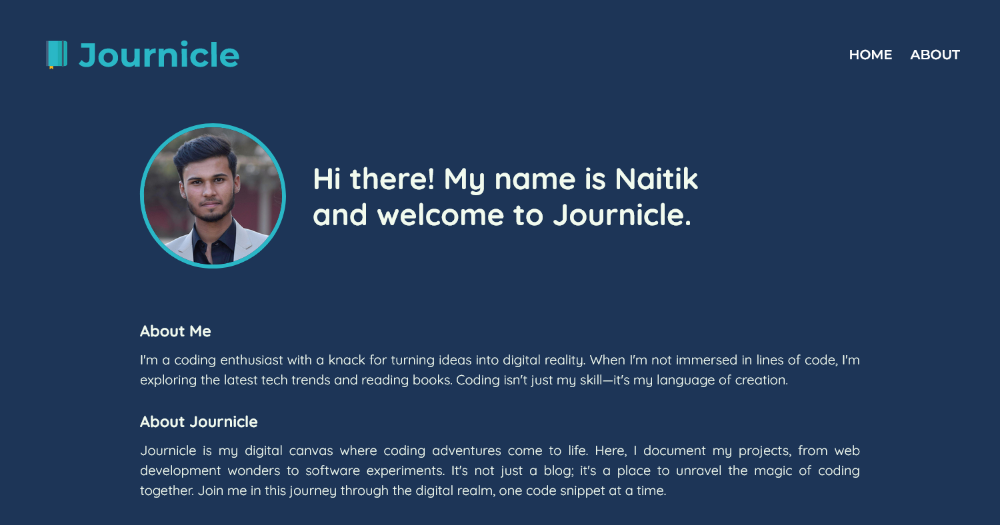

# Journicle

Journicle is a blog-style website featuring my front-end development projects. With a three-page layout, the website is fully responsive and accessible on modern browsers.

### Screenshot

### Link

- Live Site URL: [Netlify](https://journicle.netlify.app)

### Built with

- HTML
- CSS
- JavaScript

### Continued development

Initially, only three posts should be displayed in the 'Recent Posts' section and a 'View More' button should be added to reveal the rest.
